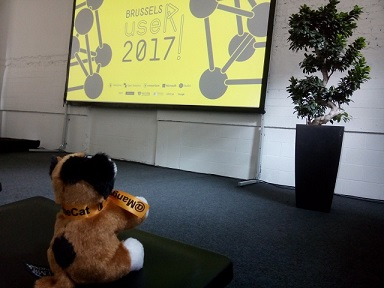
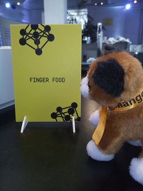
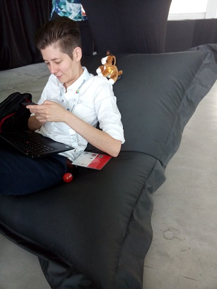

# useR!2017 Recap Day 3

Another day in the city of Brussels and another day of fantastic R talks at useR!2017. As mentioned in yesterday's [recap](https://www.mango-solutions.com/blog/user-2017-day2-recap) this conference is packed with great talks and it is hard to choose them. We weren't able to attend all talks so we will definitely be checking out the livestreams after the conference.

## Morning
We were overwhelmed by interest at our stand (mainly for the cats) so we decided to skip the keynote. From what we heard it was interesting to learn about the stats behind Dose-response analysis from Ludwig Hothorn. We did manage to catch some of the talks in the first session such as the talk by Brooke Andersen about the [drat](http://dirk.eddelbuettel.com/code/drat.html) package. Developed by (among others) Dirk Eddelbeutel the talk described how you can use drat to disseminate a data package which isn't on CRAN together with your code package (which is on CRAN). This supports the use case for when you want to give your users the ability to explore large datasets. We loved the idea as it makes sharing open data that much easier. The other talk in the same session that was excellent was by Przemyslaw Biecek on tools for visualisation of statistical model. His premise was that the grammar of graphics has unified plotting in R but not for visualising models. Przemyslaw showed several packages that do the job ([rms](https://cran.r-project.org/web/packages/rms/index.html), [forestModel](https://cran.r-project.org/web/packages/forestModel/index.html), [regtools](https://cran.r-project.org/web/packages/regtools/index.html), [survminer](https://cran.r-project.org/web/packages/survminer/index.html), [factoextra](https://cran.r-project.org/web/packages/factoextra/index.html)) but all in a different way and with a different goal. His proposal to create a unified grammar in this area definitely resonated with us and we hope it will happen soon.

In the next session we went to Andrie de Vries' talk about the [secret](https://github.com/gaborcsardi/secret) package together with a quarter of all useR! attendees (or so it seemed). Andrie explained how the secret package allows you to share encrypted passwords from within your own package. We often work with clients where we have to access their systems through passwords so this package will definitely help us. One of the cool things about useR! is that you get to hear about topics you didn't even know existed. Case in point, the talk from Finlay Scott about quantitative fisheries advice. There is a whole science behind estimating stock, creating policy and assessing policy. Finlay and his team have created the FLR package to facilitate this process. They didn't stop there, to ensure their package(s) were being used they spread the word and offered training as well. This is something that is often overlooked, when you want your package to be used you have to evangelise. 

From the next batch of talks we really liked Jonathon Love's talk about jamovi and Max Humber's talk about web scraping with [purrr](https://cran.r-project.org/web/packages/purrr/index.html) and [rvest](https://cran.r-project.org/web/packages/rvest/index.html). We're often in the situation where we have to convert analysts from using Excel to using R and [jamovi](https://www.jamovi.org/) is a tool that sits in the middle. Jonathan explained how their product makes it easier for spreadsheet users to access R and that will only make the transition easier. The slides for Max's talk can already be found [here](https://speakerdeck.com/maxhumber/webscraping-with-rvest-and-purrr). We have given workshops on web scraping in the past so we're definitely convinced of the power of rvest, especially when combined with purrr. What was different in Max's talk were his informative and hilarious examples with the Hollywood Stock Exchange and Fantasy Football.

The talk that really stood out in the session before lunch was Timo Grossenbacher's presentation about the growing popularity of R in data journalism. Timo enlightened us on what data journalism is all about with real life examples from a Swiss broadcasting company, Der Spiegel and Pro Publica. For journalists like Timo R brings the power of automation which gives them a comparative advantage. It also allows them to build a pipeline whereby they can acquire data, wrangle it, perform EDA and visualise it with little effort (thanks also to the tidyverse). The slides from his talk can be found [here](goo.gl/pF9bKU).

## Lunch
After having replenished ourselves and with renewed vigour we set off in search of more knowledge. Our first stop: the [matter](https://github.com/kuwisdelu/matter) package by Kylie Bemis. In her presentation Kylie outlined how her package allows you to perform computation on datasets that don't fit in memory. In the past we would have tackled this problem with bigmemory and sqldf but Kylie's solution is an improvement and thus worth adding to our toolkit. In another room, at the same time, Jonathan Godfrey talked about the brailleR package which makes R accessible to blind and print disabled people. Unfortunately, we didn't catch all of the talk but it's definitely a valuable effort. Check out the [GitHub](https://github.com/ajrgodfrey/BrailleR) page if you want to contribute.

In the next session we found Edwin de Jonge's presentation on the daff package interesting but we were definitely impressed by David Gohel's ggiraph talk. The [daff](https://github.com/edwindj/daff) (data-diff) package solves the use case of trying to figure out what changes have been made to your data. Based on the diff concept from *nix environments this package allows you to track these changes and then apply them to other data. We have solved this outside of R but it is off course very cool to also be able to do it within R. What is even cooler than that is the [ggiraph](https://davidgohel.github.io/ggiraph/) package to make your ggplot graphics interactive. From the man that gave us [ReporteRs](https://github.com/davidgohel/ReporteRs) (for which we will be forever grateful) now comes a package that will add interactivity to your "boring" ggplots. We have seen this kind of functionality in plotly but not as integrated into the grammar of graphics. Arguably [plotly](https://plot.ly/r/) might still offer more but we're sure ggiraph will quickly follow.    

We did a lot of session switching in the past two days and most of times this payed off. Unfortunately, all of useR! wanted to see Jim Hester (and what he had to say about ODBC but mainly him though) so we only caught some glimpses of his talk. In one of those glimpses we saw how in an upcoming RStudio release we will be able to explore SQL tables and setup ODBC connections. Only one word can describe our feelings about that: awesome! Jim also explained how easy it is to connect to any relational database and manipulate data with dplyr. You can find more information about ODBC and database connection on the [RStudio databases site](http://db.rstudio.com/). Kirill Muller followed Jim's talk with a presentation on improving DBI. We didn't attend this talk but Ian Cook's talk on [implyr](https://plot.ly/r/) referenced it quite a few times. Without the work of Kiril Muller and the dplyr team it would've been hard for anyone to create a dplyr database backend. Ian is the author of the implyr package, a dplyr database backend for [Apache Impala](http://impala.apache.org/). What was interesting about his talk was that he walked us through  how he developed his package. David Robinson posted some of his [slides](https://twitter.com/drob/status/882947621723230209) on twitter but these don't include the two reasons that we felt were the most important: persist in your effort and create automated tests.    

The keynote at the end of Day 3 was given by Norm Matloff on Parallel Computation in R and this keynote too was of a high quality. There is no way we can summarise his talk in just a few lines and we strongly recommend viewing the recorded version (as we will be doing several times). Norm made us painfully aware of how we live in a time when things are easily hyped and parallel computation is not any different. There is no "silver bullet" and there is no such thing as "automatic parallelisation". 

## AOB

* You may be thinking "what about the lightning talks?", here's a [summary](https://twitter.com/_ColinFay/status/882984973271281665) by Colin Fay.

